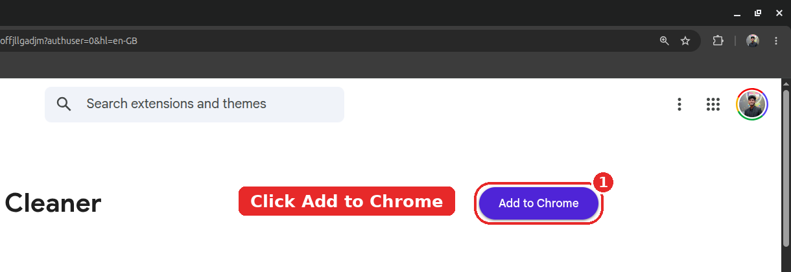
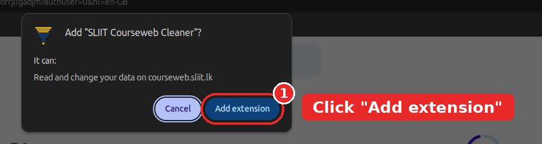
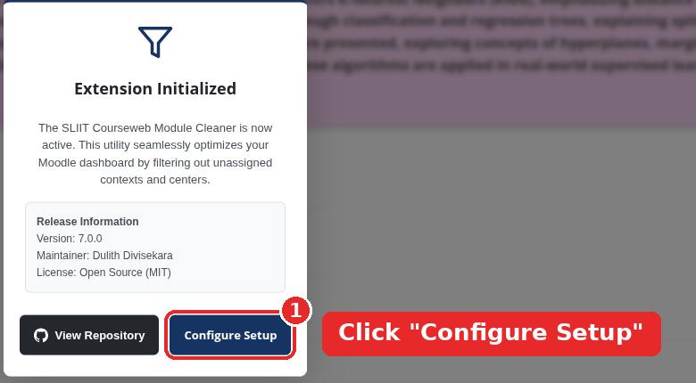
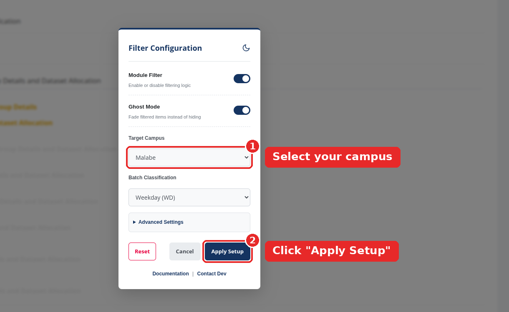
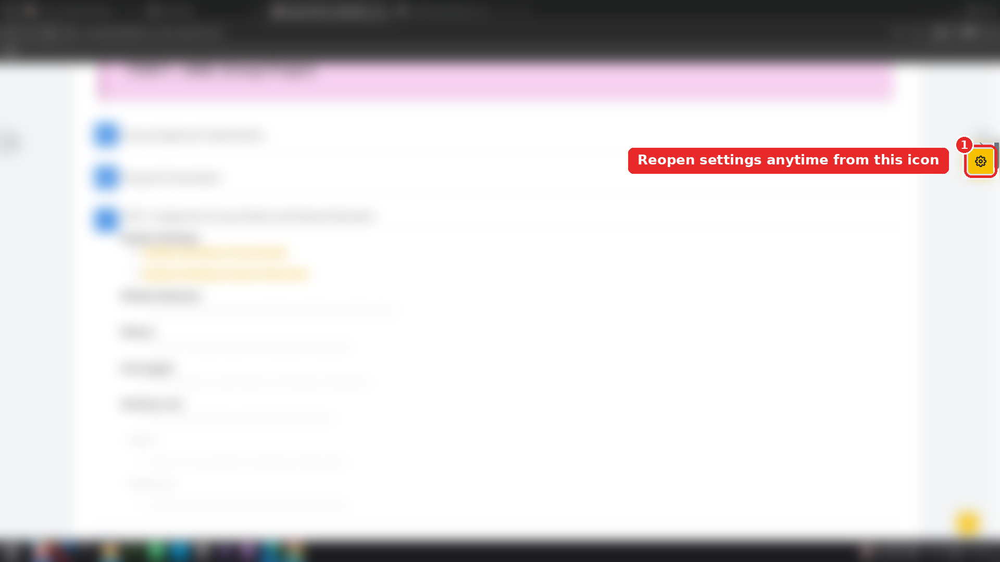

# SLIIT Courseweb Module Cleaner

  
  
  

A professional, context-aware browser extension designed to optimize the SLIIT Moodle (Courseweb) interface. It automatically filters out irrelevant modules, assignments, and announcements meant for unassigned campuses or batches, providing a clutter-free learning environment.

## Download & Install

Install the official extension directly from your browser's web store:

* **Google Chrome / Brave:** [Download on Chrome Web Store](https://chromewebstore.google.com/detail/sliit-courseweb-cleaner/lnoadlfhebmkhmbfmehdgoffjllgadjm?authuser=0&hl=en-GB)
* **Microsoft Edge:** [Download on Edge Add-ons](https://microsoftedge.microsoft.com/addons/detail/sliit-courseweb-cleaner/gmlodfhgiopjgamoijjffcmgfenkkkhe)

> **Advanced Users:** Prefer Tampermonkey? Check our [Userscript Installation Guide](USERSCRIPT_INSTALL.md).

---

## Quick Start Guide

### Step 1: Add to Browser
First, navigate to your respective web store and click the **Add to Chrome** (or **Get**) button.

  

 

Then, confirm the installation by clicking **Add extension** on the browser permission popup.

  
    

### Step 2: Initialize
Open any module page on [SLIIT Courseweb](https://courseweb.sliit.lk/). The extension will greet you with a welcome screen. Click **Configure Setup** to proceed.

  
    

### Step 3: Configure Your Preferences
Select your campus, batch type, and apply any advanced custom keywords. Click **Apply Setup** to lock in your preferences and clean your dashboard.

  
    

### Step 4: Re-access Settings & Support
If you ever need to change your filters, switch to Dark Mode, or contact the developer for support, simply click the floating yellow settings icon anchored to the right side of your Courseweb screen.

  
    

---

## Key Features

* **Smart Auto-Detect:** Automatically guesses your campus and batch to get you started instantly.
* **Custom Keywords:** Total control over what you see using custom comma-separated Whitelists and Blacklists.
* **Cloud-Synced Rules:** The extension periodically fetches community-sourced filtering rules in the background, ensuring it always stays up-to-date.
* **UI Themes:** Includes a manual Dark Mode toggle for comfortable night-time browsing.
* **Double-Lock Defense:** Prevents aggressive filtering before your initial user setup is complete.
* **Notice Protector:** Ensures critical alerts, rescheduled labs, and general shared materials remain strictly visible regardless of filter settings.

## License
This project is licensed under the MIT License. See the `LICENSE` file for details. Developed and maintained by Dulith Divisekara.