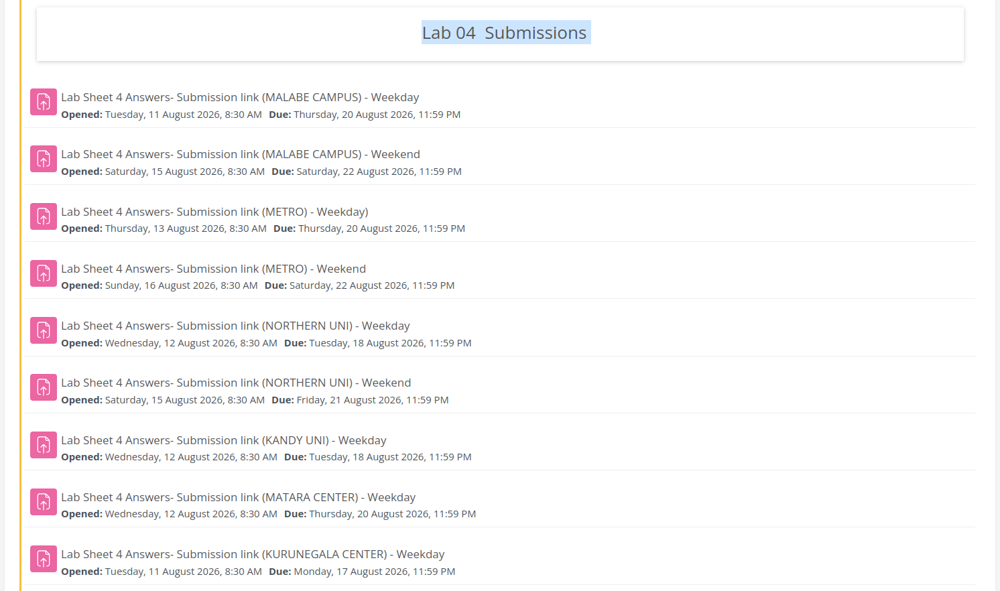
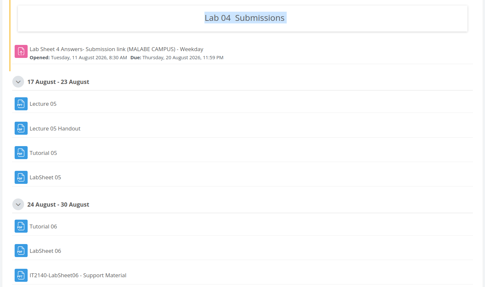
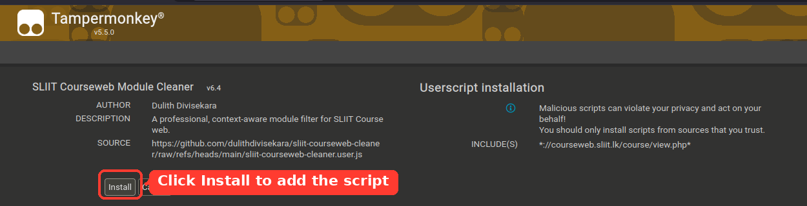
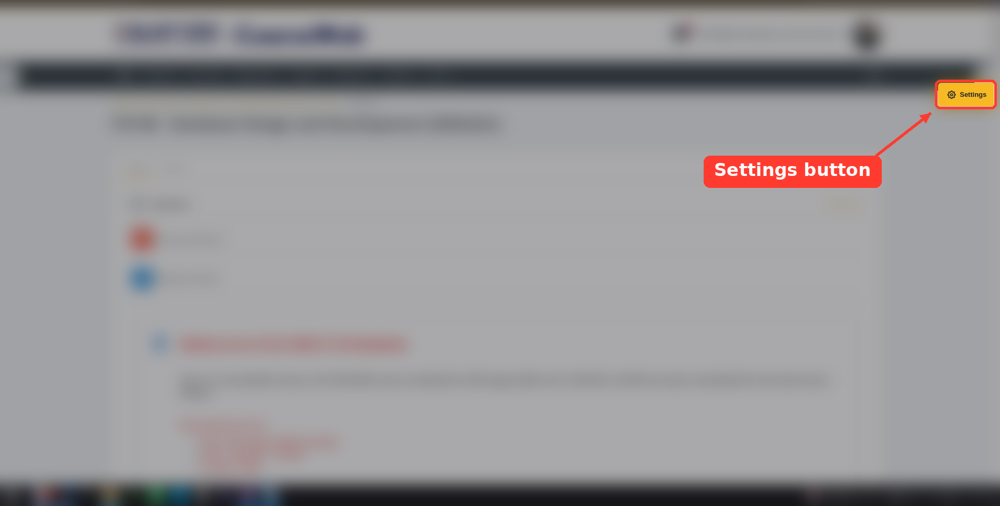
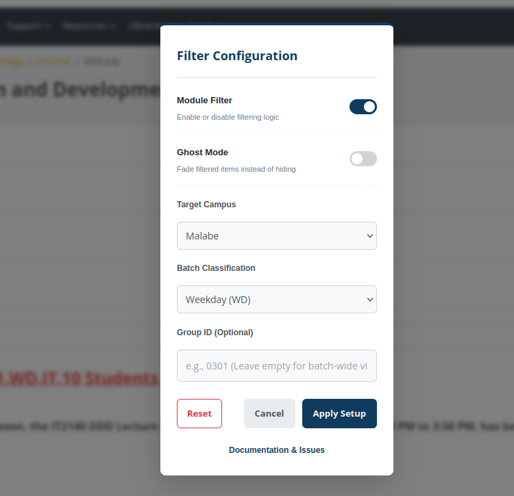

# SLIIT Courseweb Module Cleaner

A context-aware userscript designed to optimize the SLIIT Moodle (Courseweb) interface. It automatically filters out irrelevant modules, assignments, and announcements meant for unassigned campuses or batches, providing a distraction-free learning environment.

## Visual Overview

| Before (Cluttered) | After (Cleaned) |
| :---: | :---: |
|  |  |

## Key Features

* **Smart Filtering:** Hides activities belonging to unselected centers (Metro, Kandy, Matara, Northern Uni) and batch schedules (Weekday/Weekend).
* **Ghost Mode:** An optional soft-filter that dims irrelevant items (25% opacity) instead of completely removing them from the DOM.
* **Native UI Integration:** Features a fully integrated, Moodle-themed configuration panel accessible directly from the Courseweb interface.
* **Notice Protector:** Ensures critical alerts, rescheduled labs, and general shared materials remain strictly visible regardless of filter settings.
* **Silent Auto-Updates:** Leverages Tampermonkey's background update API to seamlessly deliver new features and bug fixes.

---

## Installation Guide

Follow these steps to deploy the script to your browser:

### 1. Install a Userscript Manager
You need a browser extension to run custom scripts. We recommend **Tampermonkey**.
* [Tampermonkey for Chrome](https://chrome.google.com/webstore/detail/tampermonkey/dhdgffkkebhmkfjojejmpbldmpobfkfo)
* [Tampermonkey for Firefox](https://addons.mozilla.org/en-US/firefox/addon/tampermonkey/)

### 2. Install the Script
Once Tampermonkey is active, click the link below to install the Courseweb Cleaner:

**[Install SLIIT Courseweb Cleaner](https://github.com/dulithdivisekara/sliit-courseweb-cleaner/raw/refs/heads/main/sliit-courseweb-cleaner.user.js)**

A Tampermonkey confirmation screen will appear. Click the **Install** button as shown below:

  

### 3. Initialize
Navigate to [SLIIT Courseweb](https://courseweb.sliit.lk/) and open any module page. The script will initialize automatically and display a one-time welcome screen.

---

## Configuration & Usage

You do not need to edit any code to use this script. All settings are managed through a native UI panel.

### Accessing Settings
Look for the **Settings** tab anchored to the right side of your Courseweb screen (just below the navigation bar). Click it to open the configuration modal.

  

### Setting Up Your Filter
1. **Module Filter:** Toggle the entire script on or off.
2. **Ghost Mode:** Enable this if you prefer to see dimmed versions of filtered links rather than hiding them completely.
3. **Target Campus:** Select your primary study center.
4. **Batch Classification:** Choose between Weekday (WD) or Weekend (WE).
5. **Group ID (Optional):** Enter your specific 4-digit group ID (e.g., `0301`). If left blank, the script will show all materials relevant to your general batch type.
6. Click **Apply Setup**. The page will automatically reload with your saved preferences.

  

---

## Troubleshooting & Support

If the script hides something you need, simply open the Settings panel and click **Reset** to restore the default configuration, or toggle the **Module Filter** off.

If you encounter a bug or have a feature request, please [open an issue](https://github.com/dulithdivisekara/sliit-courseweb-cleaner/issues) on this repository.

## License

This project is licensed under the MIT License. See the `LICENSE` file for details. Developed and maintained by Dulith Divisekara.