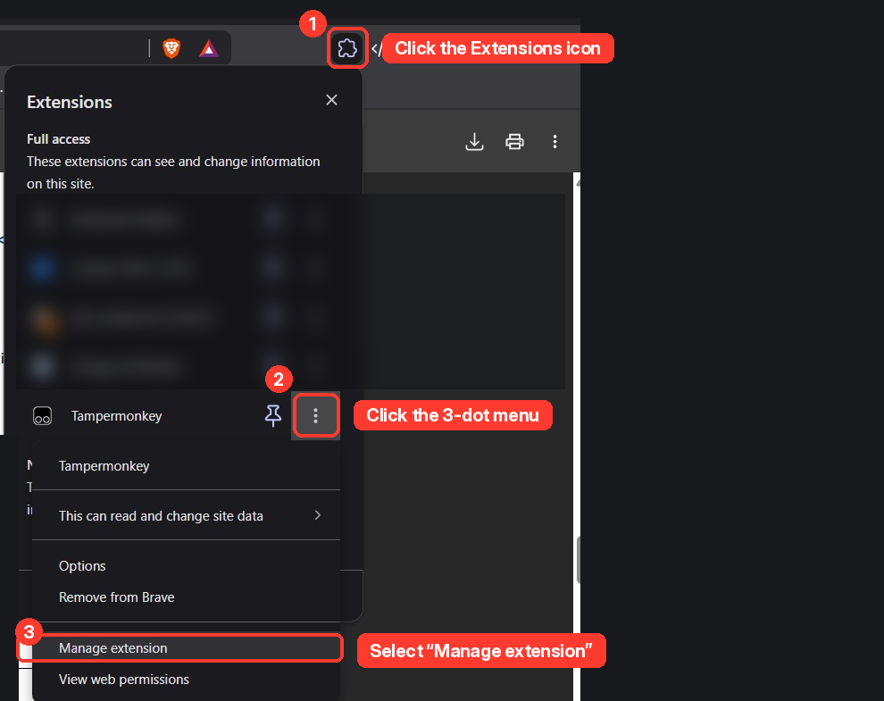
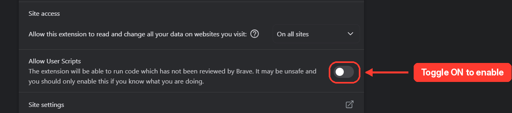

# 🛠 Advanced Userscript Installation Guide

If you are a power user who prefers using a userscript manager instead of our standalone browser extension, follow these steps to install the SLIIT Courseweb Module Cleaner via Tampermonkey.

### 1. Install a Userscript Manager
You need a browser extension to run custom scripts. We recommend **Tampermonkey**.
* [Tampermonkey for Chrome / Brave / Edge](https://chrome.google.com/webstore/detail/tampermonkey/dhdgffkkebhmkfjojejmpbldmpobfkfo)
* [Tampermonkey for Firefox](https://addons.mozilla.org/en-US/firefox/addon/tampermonkey/)

**Important Note for Chromium (Chrome/Brave/Edge) Users:**
Recent browser security updates require you to explicitly allow Tampermonkey to execute scripts. After installing the extension:
1. Right-click the Tampermonkey icon in your browser toolbar and select **Manage Extension**.

   
  
    

2. Scroll down to the settings page and toggle on **Allow User Scripts** (as shown below).

   
  
    

### 2. Install the Script
Once Tampermonkey is active and configured, click the link below to install the Courseweb Cleaner:

**[Install SLIIT Courseweb Cleaner](https://github.com/dulithdivisekara/sliit-courseweb-cleaner/raw/refs/heads/main/dist/sliit-courseweb-cleaner.user.js)**

A Tampermonkey confirmation screen will appear. Click the **Install** button as shown below:

   
  
    

### 3. Initialize
Navigate to [SLIIT Courseweb](https://courseweb.sliit.lk/) and open any module page. The script will initialize automatically. You can configure your preferences by clicking the yellow Settings icon anchored to the right side of your screen.